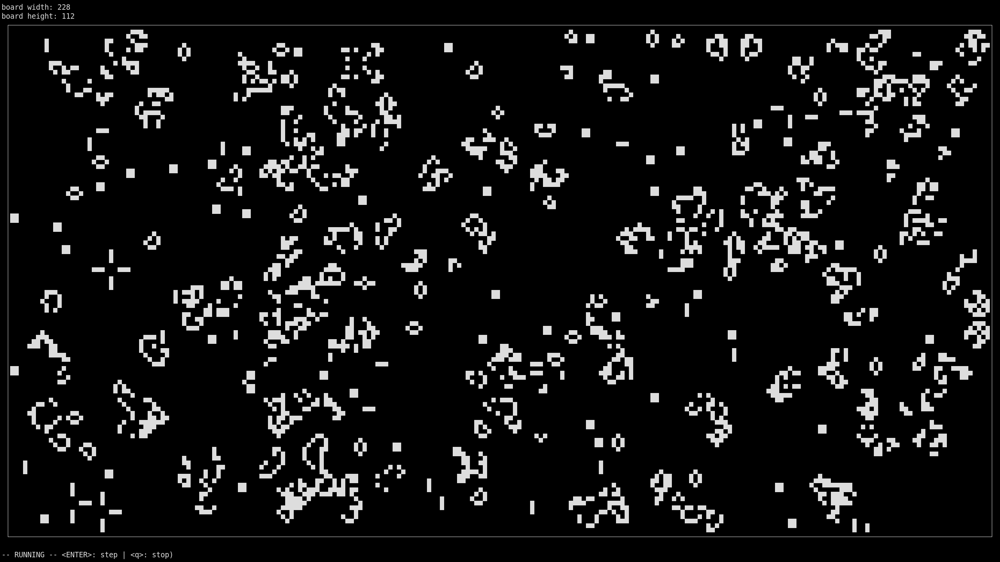

# game-of-life
Conway's game of life in C

Compile and run with:
```bash
$: gcc game_of_life.c -lncursesw -o game-of-life-linux-amd64 && ./game-of-life-linux-amd64
```
The "`w`" in "`-lncursesw`" might not be needed for some systems.


